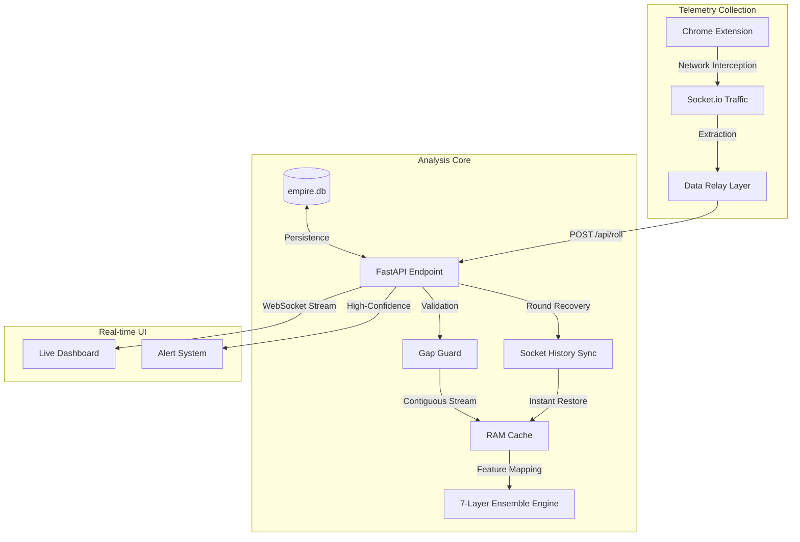

# 🎰 Empire-Predictor — v4.8

## 📋 Table of Contents

- [System Overview](#system-overview)
- [Logic Architecture](#logic-architecture)
- [Installation](#installation)
- [Usage Guide](#usage-guide)
- [Folder Structure](#folder-structure)
- [API Endpoints](#api-endpoints)
- [Technical Documentation](#technical-documentation)
  - [📖 System Flow & Sequence](docs/ARCHITECTURE.md)
  - [🧠 Logic Layer Breakdown](docs/MODULES.md)
  - [⚙️ Operational Workflows](docs/WORKFLOW.md)
  - [🧪 Strategy Validation](docs/BACKTESTING.md)
  - [🔧 Optimization & Maintenance](docs/OPTIMIZATION.md)

---

## System Overview

Empire-Predictor is a high-performance data analysis engine for CSGOEmpire Roulette, built on a **7-layer Ensemble Engine** architecture. The system consists of three primary components working in synchronization:



### v4.8 — Socket History Sync
- **Zero-Latency Telemetry**: Direct data extraction from the official Socket.io stream.
- **Auto-Healing**: Instant gap restoration using the captured 100-round historical array.
- **Sequence Integrity**: Predictive modules are only activated once 60 rounds of contiguous data are verified.

---

## Logic Architecture

The system utilizes **7 parallel computational modules**, with results aggregated through a weighted ensemble model:

| # | Module | Methodology | Description |
|---|-------|-------------|-------|
| 1 | **Sequence Analyzer** | Recurring logic | Deep sequence analysis with Attention-based focus on pivot points. |
| 2 | **State-Space Module** | Parameter-dense | Efficiently identifies patterns in long-range data sequences. |
| 3 | **Temporal Fusion** | Temporal attention | Analyzes intra-round dependencies and multi-horizon trends. |
| 4 | **Neural Forecasting** | Hierarchical logic | High-frequency forecasting using hierarchical frequency interpolation. |
| 5 | **Markov Chain** | Probability | Order-3 state transitions based on comprehensive historical databases. |
| 6 | **Statistical Engine** | Math stats | Analyzes Entropy, Streak dynamics, and Frequency Deviation. |
| 7 | **Dynamic Learner** | Reinforcement logic | Real-time strategy optimization based on live outcomes. |

---

## Installation

### Prerequisites
- Python 3.11+
- Google Chrome

### 1. Environment Setup

```bash
pip install -r requirements.txt
```

### 2. Chrome Extension Setup

1. Open Chrome → `chrome://extensions/`
2. Enable **Developer Mode**.
3. Click **Load Unpacked**.
4. Select the `csgoempire-extension/` directory.

### 3. Start Server

```bash
python server/main.py
```

The server initializes at `http://localhost:8000`.

### 4. Access Dashboard

Open `dashboard/index.html` in your browser.

---

## Usage Guide

1. **Start the Server** before accessing the floor.
2. **Open CSGOEmpire Roulette** (The extension will automatically begin data capture).
3. **Monitor the Dashboard** for probability estimations and recommended actions.
4. The system requires at least **60 consecutive rounds** to warm up the sequence-based modules.

---

## Folder Structure

```
Empire-Predictor/
├── README.md
├── requirements.txt
├── empire.db                     # SQLite database (126k+ rounds)
├── data.txt                      # Raw captured data
├── clean_data.py                 # Data normalization utility
│
├── server/                       # Core Analytics Backend
│   ├── main.py                   # Entrypoint & Logic Orchestration
│   ├── database.py               # Database interaction layer
│   ├── train.py                  # Module optimization utility
│   ├── models/
│   │   ├── ensemble.py           # Weighted result aggregator
│   │   ├── features.py           # Feature engineering & preprocessing
│   │   ├── *_model.py            # Individual mathematical modules
│   │   └── saved/                # Pre-optimized parameters
│
├── csgoempire-extension/         # Data Harvesting Tool
│   ├── content.js                # WebSocket Interceptor
│   └── background.js             # Data relay to backend
│
├── dashboard/                    # Real-time Visualizer
│   ├── index.html                # Main UI
│   └── dashboard.js              # Real-time UI logic
│
└── docs/                         # Technical Documentation
    ├── ARCHITECTURE.md           # System flow & Sequence
    ├── MODULES.md                # Logic layer breakdown
    ├── WORKFLOW.md               # Operational pipelines
    ├── BACKTESTING.md            # Strategy validation
    └── OPTIMIZATION.md           # Retraining & Troubleshooting
```

---

## API Endpoints

- `POST /api/roll`: Receive new round data.
- `GET /api/predict`: Retrieve current predictive estimations.
- `GET /api/stats`: System health and historical statistics.
- `WS /ws`: Real-time WebSocket feed for the Dashboard.

---

*Empire-Predictor — Professional Data Analytics for High-Frequency Sequences.*
