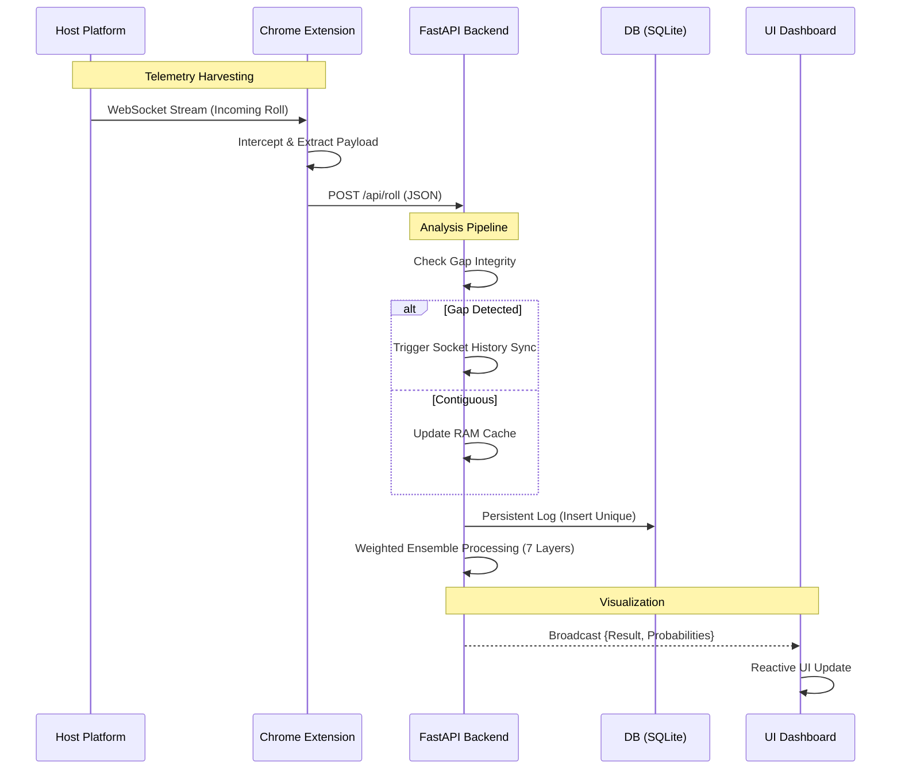

# System Architecture — Empire-Predictor v4.8

## 1. Component Overview

The system is designed with a 3-layer decoupled architecture to ensure high stability and precision in round data processing.

---

## 2. Data Lifecycle (Data Pipeline)

### Phase 1: Harvesting (Chrome Extension)
The extension acts as a network interceptor, listening to WebSocket packets from the host platform to extract raw round information, including unique round IDs, outcomes, and historical data arrays.

### Phase 2: Relay & Transformation
Raw telemetry is transmitted to the server via HTTP POST. A background script performs value mapping, converting numerical outcomes into color-coded identifiers.

### Phase 3: Analytics & Estimation (Backend)
The server validates data integrity through multiple safeguards:
- **Gap Check**: Detects discontinuities in the round sequence.
- **Socket Sync**: Leverages the socket-captured history array to instantly restore context.
- **Engine Processing**: 7 parallel mathematical modules analyze the last 60 rounds to generate probability estimations.

### Phase 4: Visualization (Dashboard)
Aggregated results are broadcast via WebSocket to the user interface, displaying dynamic confidence levels and historical distribution.

---

## 3. Data Protection Layers

### 3.1 Gap Guard
Protects the data stream from contamination caused by network interruptions. If non-sequential round IDs are detected, the system suspends estimations until a contiguous sequence is restored.

### 3.2 Socket History Sync
A zero-delay recovery mechanism. Instead of populating the cache incrementally, the system uses the 100-round array provided in the socket packet to restore operational state within a single round.

### 3.3 Sequence Validation
Ensures sequence-based algorithms only operate on verified contiguous contexts. This prevents estimations based on fragmented or unrepresentative trends.
