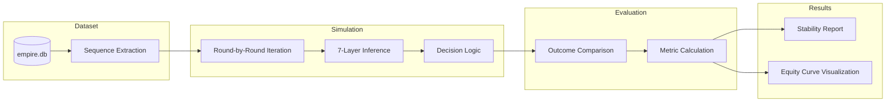
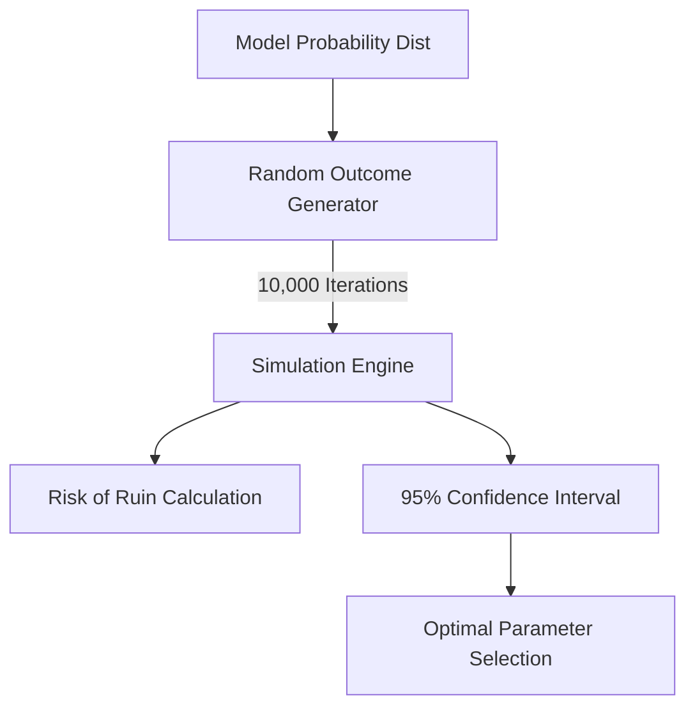

# Backtesting & Strategy Validation — Empire-Predictor

To ensure operational stability, the system includes a dedicated verification layer for testing logic against historical datasets.

---

## 1. Backtesting Engine

The backtesting engine simulates live market conditions using historical sequences stored in `empire.db`. This allows for the evaluation of ensemble weights and module performance without risk.



---

## 2. Monte Carlo Simulation

For advanced risk management, the system performs Monte Carlo simulations to model thousands of hypothetical session outcomes based on the current model probability distribution.



### Key Metrics Tracked:
- **Max Drawdown**: Maximum peak-to-trough decline.
- **Sharpe Ratio**: Risk-adjusted return calculation.
- **Recovery Factor**: Ability to recover from loss streaks.
- **Win Rate (Adjusted)**: Probability of a positive session outcome.

---

## 3. Operational Guide (Backtest)

To run a full strategy backtest:

```bash
# Execute the backtest engine
python server/backtest/engine.py --rounds 5000 --balance 100
```

The system will generate a `backtest_results.csv` and summary metrics in the terminal.
