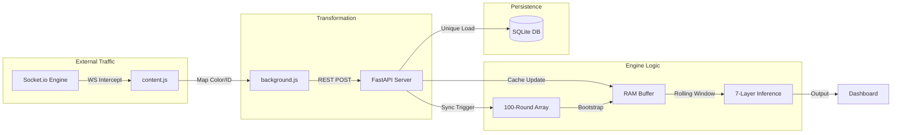
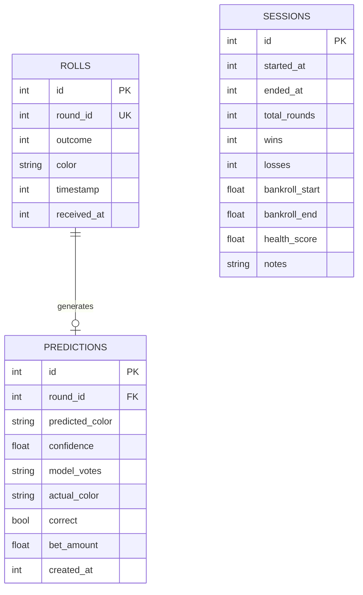

# Data Lifecycle — Data Pipeline

## 1. Data Harvesting Flow



---

## 2. Database Schema (empire.db)

### Table: `rolls`
```sql
CREATE TABLE rolls (
    id        INTEGER PRIMARY KEY AUTOINCREMENT,
    round_id  INTEGER UNIQUE NOT NULL,   -- Game round ID
    outcome   INTEGER NOT NULL,          -- Numerical result (0-14)
    color     TEXT NOT NULL,             -- 'T', 'CT', 'Bonus'
    timestamp INTEGER,                   -- Unix timestamp (ms)
    created_at DATETIME DEFAULT CURRENT_TIMESTAMP
);
CREATE INDEX idx_round_id ON rolls(round_id);
```



### Data Integrity Safeguards
- **UNIQUE Constraint**: Ensures zero duplication of round IDs.
- **INSERT OR IGNORE**: Automatically filters out stale or redundant data packets.

---

## 3. Memory Architectures

### Layer 1: Persistent Storage
Handled by `empire.db`, storing the complete historical sequence (~126k+ rounds).

### Layer 2: Working Cache (RAM Buffer)
A list of the latest **500 rounds** held in memory for immediate access by analytical modules.

### Layer 3: Predictive State
The internal state maintained by the modules. Sequence-based modules require a minimum contiguous window of **60 rounds** to activate.

---

## 4. Feature Extraction (features.py)

The `compute_features_array()` function transforms historical sequences into **numerical feature vectors**:

- **Lag Features**: Outcome history from the last 10-20 rounds.
- **Dynamic Metrics**: Streak length, Entropy (Shannon), and Frequency Deviation.
- **Cycle Indicators**: Distance since the last Bonus outcome.
- **Transition Probabilities**: Markov-based state transition matrices.

---

## 5. Socket Sync (v4.8)

Automates context restoration by bypassing the incremental population of the cache:

```
payload.history_full = ['CT', 'T', 'T', ...]  ← 100-round array from socket
          │
          ▼ Triggered on Gap or Startup
recent_colors_cache = history_full[-500:]
is_warmed_up = True  ← Instant Activation!
```
