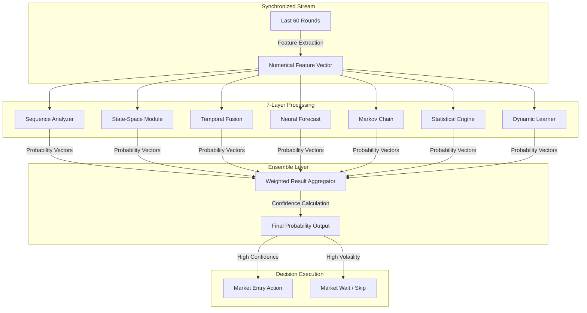
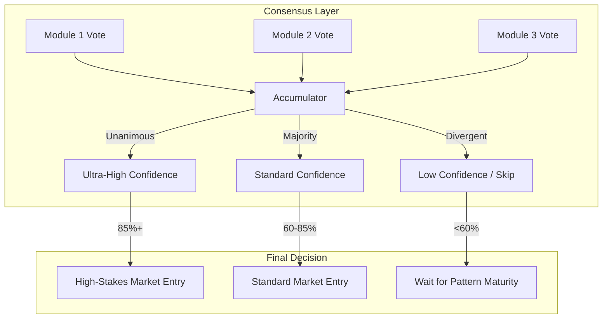

# Analytics Modules — Empire-Predictor

The system operates based on the integration of 7 independent analytical modules. Each module utilizes a distinct mathematical or statistical methodology to evaluate market trends.

---

## 1. Sequence Analyzer
Based on long-range sequence analysis with an Attention mechanism to prioritize high-volatility pivot points. This module requires 60 consecutive rounds for optimal reliability.

## 2. State-Space Module
Utilizes dense state-space variables to simulate outcome transitions. Highly effective for identifying complex recurring patterns in large datasets.

## 3. Temporal Fusion
Analyzes the intersection of temporal factors and round outcomes, identifying multi-horizon dependencies and cyclical trends.

## 4. Forecasting Engine (Hierarchical)
Combines forecasts across different frequency levels, from short-term micro-fluctuations to long-term macro-trends, providing a comprehensive view of the sequence state.

## 5. Markov Chain (Order-3)
Calculates probabilities based on the states of the last 3 rounds. This method is highly efficient for detecting basic "streak" or "alternating" patterns.

## 6. Statistical Engine
Calculates pure mathematical metrics:
- **Entropy**: Evaluates the predictability and randomness of recent rounds.
- **Deviation**: Monitors frequency shifts compared to the historical mean.
- **Streak Logic**: Analyzes the length and probability of consecutive outcomes.

## 7. Dynamic Learner
Automatically optimizes internal parameters based on live market outcomes in real-time. This module records encountered states and their performance to refine future estimations.

---

## Ensemble Mechanics
Final results are not derived from a single module but are a weighted aggregation from the entire stack. High-complexity sequence modules are given higher precedence during stable data phases, while statistical modules lead during periods of high volatility.
