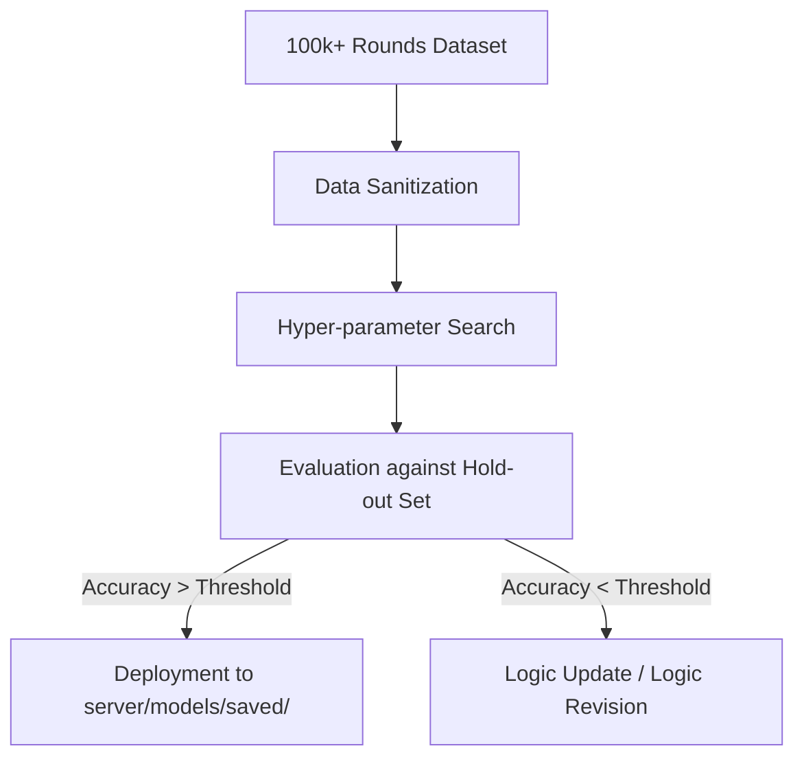
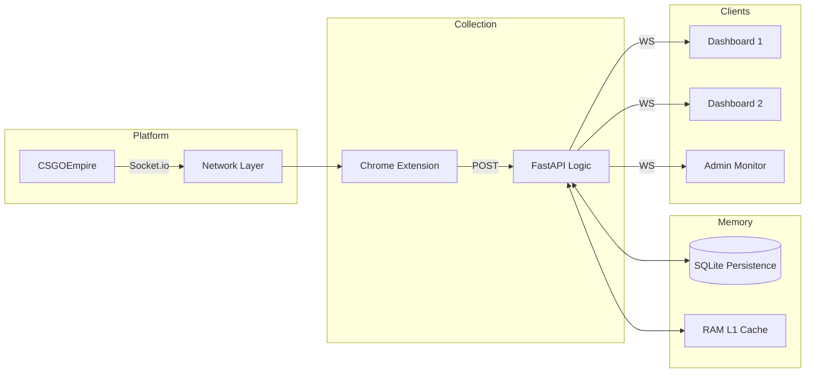

# System Optimization & Troubleshooting — Empire-Predictor

Guidelines for maintaining peak operational performance and resolving common technical challenges.

---

## 1. Parameter Tuning & Retraining

To maintain accuracy, the mathematical modules require periodic re-optimization against the latest market data.

### Optimization Workflow

### Key Hyper-parameters:
- **Sequence Length (`seq_len`)**: Default is 60. Increasing to 100 improves long-range pattern detection but increases warm-up time.
- **Ensemble Weights**: Adjusted in `ensemble.py` based on recent performance.
- **Softmax Temperature**: Controls the "sharpness" of probability distributions.

---

## 2. Troubleshooting Registry

| Issue | Potential Cause | Resolution |
|-------|----------------|------------|
| **"Waiting for Contiguous Data"** | Network gap or stale ID | Wait for the Socket Sync to complete (Auto-healing). |
| **Prediction Drift** | Market regime shift | Perform a full retraining via `server/train.py`. |
| **Dashboard Lag** | High client load | Reduce uvicorn logging or optimize `dashboard.js` render frequency. |
| **"Duplicate Round ID"** | Rapid socket events | System auto-ignores via `UNIQUE` constraint (No action required). |

---

## 3. Scaling & Production Best Practices

For users running the system in high-load environments:

- **Async Workers**: Run uvicorn with multiple workers for improved concurrent request handling.
- **Database Vacuum**: Periodically run `VACUUM` on `empire.db` to maintain SQLite performance.
- **Memory Management**: The `recent_colors_cache` is capped at 500 rounds to prevent excessive RAM consumption.

---

## 4. System Scaling Map

