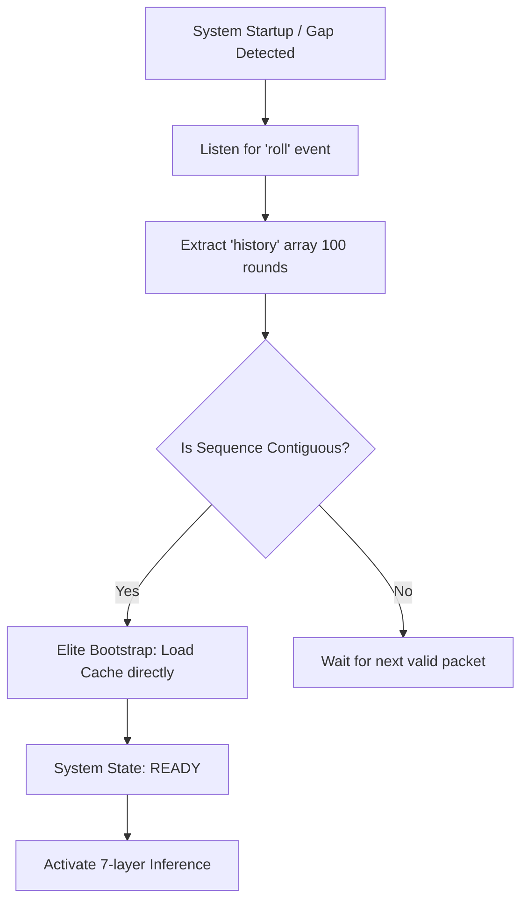
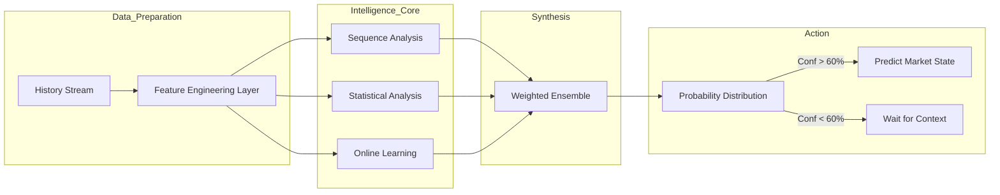
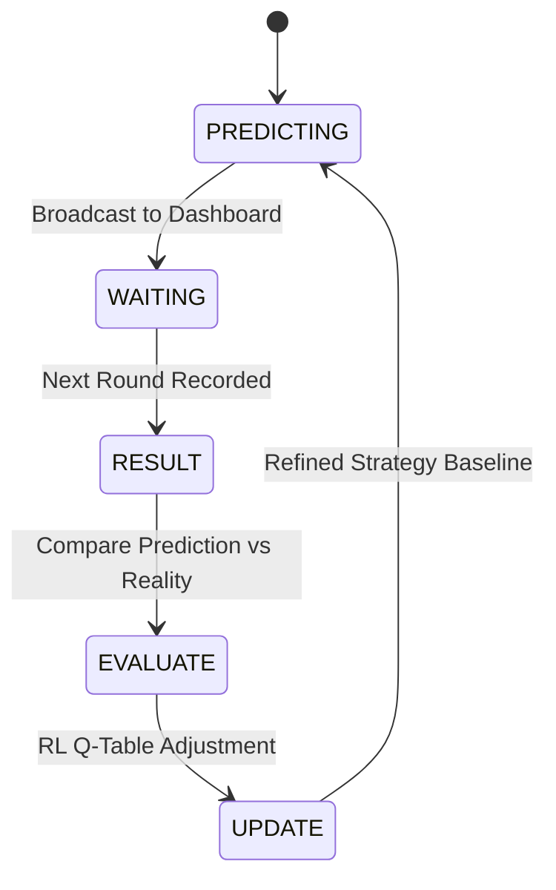
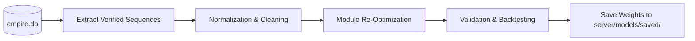
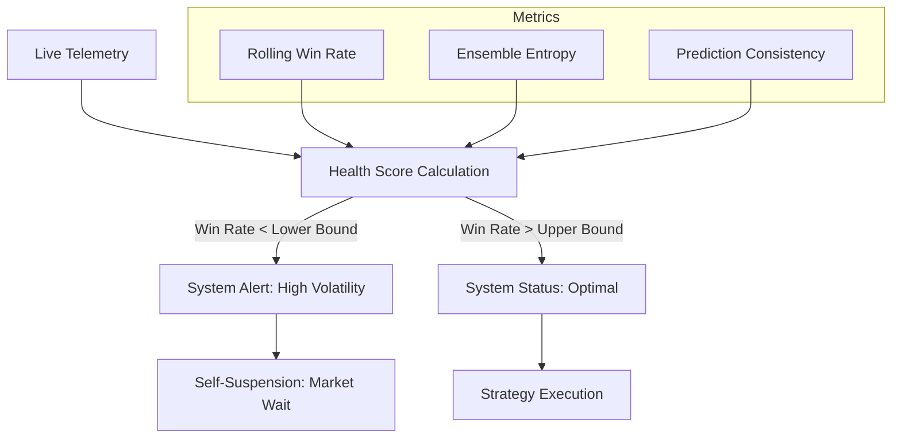
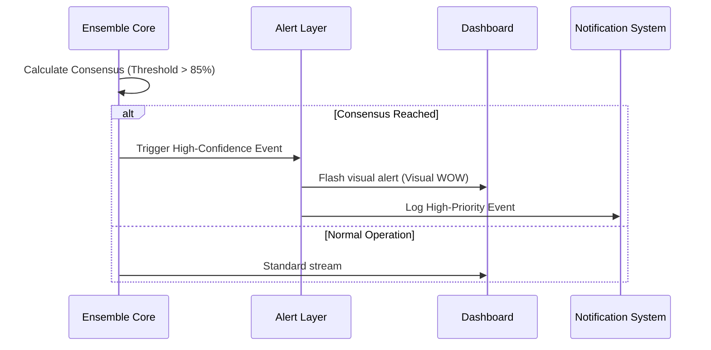

# Operational Workflows — Empire-Predictor

This document outlines the high-level operational workflows for model synchronization, real-time inference, and ensemble decision-making.

---

## 1. Zero-Delay Synchronization Workflow
This workflow ensures the backend is instantly ready for prediction upon system startup or after a network gap.

---

## 2. Model Inference & Decision Workflow
How the system transforms raw numerical outcomes into weighted probability estimations.

---

## 3. Real-time Feedback Loop
The Dynamic Learner (RL Agent) optimizes the system based on actual results.

---

## 4. Maintenance Workflow (Optimization)
Periodic optimization of persistent parameters (TensorFlow/Torch weights).

---

## 5. Round Execution Timeline (Low Latency)
A visual breakdown of the millisecond-level processing that occurs after a round result is finalized.

```mermaid
gantt
    title Single Round Processing Lifecycle
    dateFormat  ss
    axisFormat  %S
    section Telemetry
    Socket Extraction    :a1, 00, 1s
    POST Relay to API    :a2, after a1, 1s
    section Logic Core
    Gap Guard Check      :b1, after a2, 1s
    Database Persistent  :b2, after b1, 1s
    7-Layer Inference    :b3, after b2, 2s
    Weighted Ensemble    :b4, after b3, 1s
    section Feedback
    WebSocket Broadcast  :c1, after b4, 1s
    UI Reactive Sync     :c2, after c1, 1s
    RL Q-Table Update    :c3, after c2, 1s
```

---

## 6. System Health & Self-Monitoring Workflow
The system actively monitors its own "Health Score" to ensure estimation accuracy remains above acceptable thresholds.

---

## 7. High-Confidence Alert Workflow
Triggers when multiple analytical modules reach a consensus above a predefined threshold.

---
*Empire-Predictor — High-Fidelity Sequence Intelligence.*
